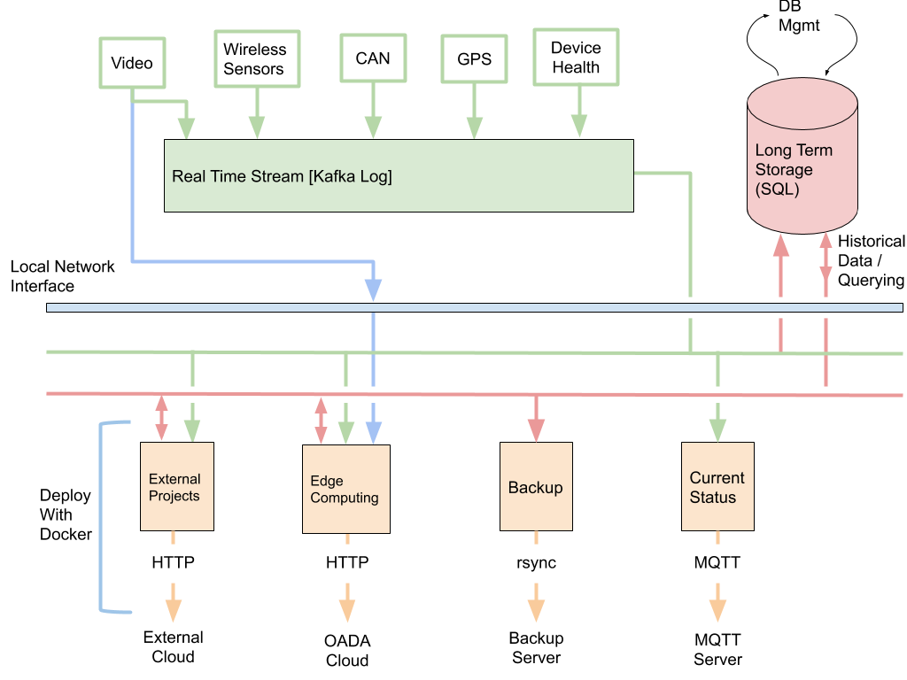

# The Avena Architecture
This a a quick (Very WIP) summary of the Avena Architecture and the design decisions we made

## Design Requirements
In creating the ISOBlue Avena edge computing device, we sought to fulfill the following requirements:
- An x86 Platform
- b
- c 

## Hardware
### LattePanda

### Custom Hat

## Software
Fig 1 shows a pictorial representation of the Avena software stack:

### Apache Kafka
### PostgreSQL