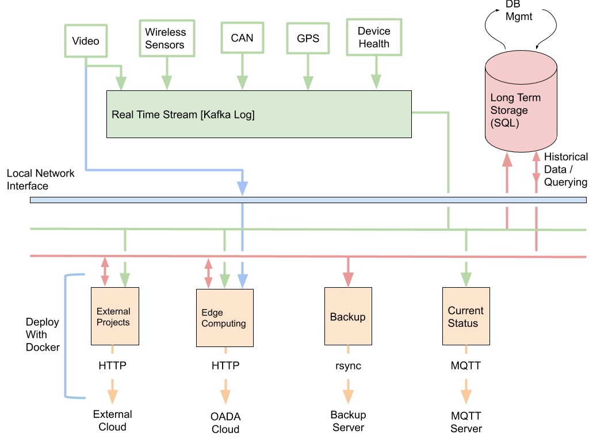

# What is ISOBlue Avena?

In short, Avena turns any ISOBlue into a easy to manage, highly capable edge
computing device.

In a bit more detail, ISOBlue Avenas are still true to their name and work with
a machine's CAN/ISOBus data; however, it is no longer limited to just this
stream. External hardware, radios, and sensors can easily be connected and
integrated. User applications are trivially deployed to in-the-field units and,
in most cases, do not require any knowledge of the embedded platform that they
run on. Single ISOBlue units are time shareable across many users and tasks,
with each task running in its own sandbox unable to access the other (unless, of
course, you want them to!).

Avena is byproduct of lessons learned with ISOBlue, ISOBlue 2.0, and ISOBlue HD,
combine with the OATS Center's experience with modern cloud technologies. It
intends to aggressively abstract away the embedded platform so that users can
focus entirely on creating and relying on high quality applications for
Agricultural (and other) equipment. We do this by leveraging the very same
software that modern cloud infrastructures do!

For example, Avena leverages (but does not necessarily require)

- [Wireguard](https://www.wireguard.com/) and SSH Central Authority
  authorization for secure and convenient multi-user fleet access,
- [Ansible](https://www.ansible.com/) for automated deployments and maintenance
  of the system tools,
- [Docker](https://www.docker.com/) for deployment and maintenance of services
  and user applications,
- [Kafka](https://kafka.apache.org/) to abstract accessing CAN, Bluetooth sensor
  data, etc.,
- and much more.

_TODO: update this_

## Getting started

ISOBlue Avena supports multiple base hardware platforms. For example, it has
been installed on Toradex Apalis, UDDO x86, and LattePanda Delta/Alpha boards.
For the most part, if you have an embedded platform that supports Linux, you can
probably deploy some subset of Avena. Currently only the Toradex Apalis is
"officially" supported, with the LattePanda in progress. If you happen to build
out support for an alternative platform, please submit a pull request. Please
note that some platforms may require additional hardware for full functionality.
For example, the LattlePanda requires additional hardware "hats" for power
management and celluar/CAN communication"

## Installing Avena

Installing Avena is a two part process

1. Install the base operating system.
2. Install the Avena and deploy.

The first step is generally automated but may require some one-time only dirty
work. Each device is a different and you can find platform specific instructions
below. The second step is fully automatic, after setting up your fleet
management structure (if you so choose).

### Step 1: Installing the base operating system

#### Toradex

##### Apalis v1.0/v1.1

- [Automatic (recommended)](hardware/toradex/install-apalis.md)
- [Manual](hardware/toradex/install-apalis-manual.md)

### Step 2: Installing Avena

<!-- - [Avena with Wireguard and Vault CA](avena/install-wireguard-vault-ca.md) -->

## Concepts

- [SSH Central Authority (CA) - Authentication](concepts/ssh-ca.md)
